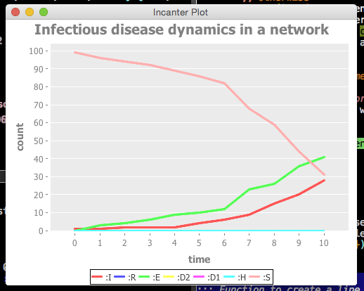

# EPI501 Clojure project

This is a project created for a network-based SEIR infectious disease modeling for the EPI501 Dynamics of Infectious Disease class at Harvard School of Public Health.

## Installation

Clone the Leiningen project directory

## Usage

For testing, do the following in the project directory

    $ lein test

## Example figure

## License

Copyright © 2014 Kazuki Yoshida

Distributed under the Eclipse Public License either version 1.0 or (at
your option) any later version.
